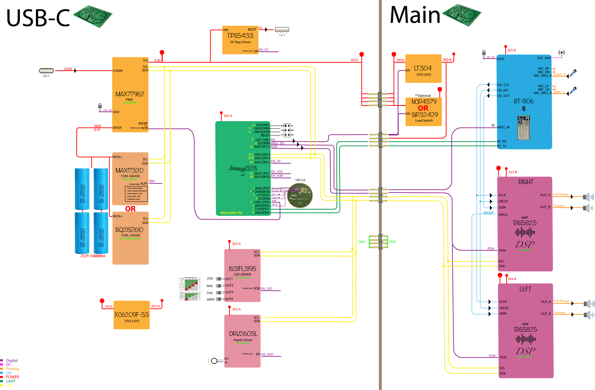

# Overview

A fully functional Bluetooth Speaker implements most of the modern features. The goal is to have a High-performance portable Bluetooth speaker with a modern design.

In this speaker, I tried combining all modern features to have pure sound and the easiest method to construct it, keeping it affordable. ATmega328P microcontroller at its core, and compatibility with Arduino. Along with FSC-BT806 featuring Qualcomm® CSR8675. And as for the amplifier, 2x Texas Instruments® TAS5825M, Which has low distortion and can output 2x 30 W.

So far, I have built and tested PCBs as prototypes, which work as expected. The hardware design is mainly done. However, the software part is still under process; and this is where I need most of the help. Please refer to the shared files for more information.

# Features
	
* **Amplifier** - 2x  Texas Instruments® [*TAS5825M*](https://www.ti.com/product/TAS5825M) Which has low distortion can output 2x 30 W, 2.2 Mode (8-Ω, 24 V, THD+N=1%)
* **Connectivity** - The [*FSC-BT806 Feasycom*](https://github.com/Mala2/FSC-BT806) features
 Qualcomm® **CSR8675** - **Bluetooth V5.0** Support HSP, HFP, A2DP, AVRCP, PBAP,MAP,SPP,BLE profile - Coverage up to 15m - 2 microphone inputs - **Audio interfaces:** I²S/PCM and SPDIF

* **Power** - Accept **USB C IN** Delivery **Up to 2.5A  Charge Current**  - **USB A OUT** Capable of **10W-5V,2A** - **Low idle power** consumption - **7500mAh** battery capacity upgradeable to **15000mAh**

* **Arduino IDE Programmable Bluetooth-Speaker**

# Block Diagram

The following displays the latest Block Diagram; Things may change, and probably there may be some discrepancy between the schematic and the block diagram.

