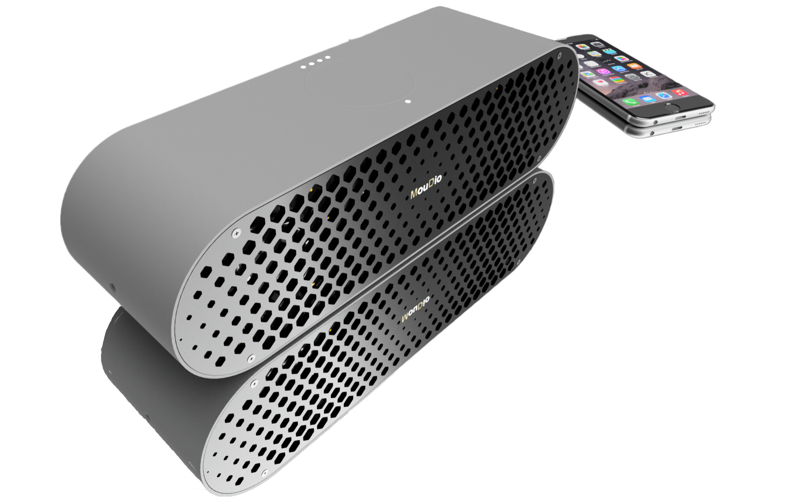

Introducing the fully functional Bluetooth Speaker, featuring modern design and high-performance capabilities. With the choice of ATmega328P or ESP32 microcontroller at its core and compatibility with Arduino & Platformio, this portable speaker offers easy construction, allowing users to quickly and easily set it up, and the high-quality audio ensures that your music will sound great. 

The speaker also boasts the Qualcomm® CSR8675 FSC-BT806 and 2x Texas Instruments® TAS5825M amplifiers, providing low distortion and powerful output of 2 x 30 W.

The PCB prototypes have been built and tested, with excellent results. The hardware design is complete, and we are now focusing on the software development. We invite you to explore the shared files for more information on this exciting project.

## Features
	
* **Amplifier** - 2x  Texas Instruments® [*TAS5825M*](https://www.ti.com/product/TAS5825M) Which has low distortion can output 2x 30 W, 2.2 Mode (8-Ω, 24 V, THD+N=1%)
* **Connectivity** - The [*FSC-BT806 Feasycom*](https://github.com/Mala2/FSC-BT806) features
 Qualcomm® **CSR8675** - **Bluetooth V5.0** Support HSP, HFP, A2DP, AVRCP, PBAP,MAP,SPP,BLE profile - Coverage up to 15m - 2 microphone inputs - **Audio interfaces:** I²S/PCM and SPDIF

* **Power** - Accept **USB C IN** Delivery **Up to 2.5A  Charge Current**  - **USB A OUT** Capable of **10W-5V,2A** - **Low idle power** consumption - **7500mAh** battery capacity upgradeable to **15000mAh**

* **Arduino IDE Programmable Bluetooth-Speaker**

## Specification

| Resources            | Parameter                                                                | Datasheet                                                                                                                                                       |
|----------------------|--------------------------------------------------------------------------|-----------------------------------------------------------------------------------------------------------------------------------------------------------------|
| Atmega328p           | 8-bit AVR microcontroller, 32Kbytes, 1Kbytes EEPROM, 2Kbytes SRAM, 16MHz | [Datasheet](https://ww1.microchip.com/downloads/en/DeviceDoc/Atmel-7810-Automotive-Microcontrollers-ATmega328P_Datasheet.pdf)                                   |
| ESP32-WROOM-32E-H4   | 240MHz dual core, 600 DMIPS, 520KB SRAM, Wi-Fi                           | [Datasheet](https://www.espressif.com/sites/default/files/documentation/esp32-wroom-32e_esp32-wroom-32ue_datasheet_en.pdf)                                      |
| LED Driver           | IS31FL3195                                                               | [Datasheet](https://www.lumissil.com/assets/pdf/core/IS31FL3195_DS.pdf)                                                                                         |
| Haptic Driver        | DRV2605L                                                                 | [Datasheet](https://www.ti.com/lit/gpn/drv2605l)                                                                                                                |
| RTC                  | RV-8803                                                                  | [Datasheet](https://www.microcrystal.com/en/products/real-time-clock-rtc-modules/rv-8803-c7/)                                                                   |
| Touch Sensor         | TPR54/48                                                                 | [Datasheet](https://www.azoteq.com/images/stories/pdf/proxsense_gpio_trackpad_datasheet.pdf)                                                                    |
| EEPROM               | 24LC32A                                                                  | [Datasheet](https://ww1.microchip.com/downloads/aemDocuments/documents/MPD/ProductDocuments/DataSheets/24AA32A-24LC32A-32-Kbit-I2C-Serial-EEPROM-20001713N.pdf) |
| Supervisory          | APX823-23                                                                | [Datasheet](https://www.diodes.com/assets/Datasheets/APX823_824_825A.pdf)                                                                                       |
| 3S Charger           | MAX77961                                                                 | [Datasheet](https://datasheets.maximintegrated.com/en/ds/MAX77960-MAX77961.pdf)                                                                                 |
| Fuel Gauge           | MAX17320                                                                 | [Datasheet](https://datasheets.maximintegrated.com/en/ds/MAX17320.pdf)                                                                                          |
| 5V Buck              | MAX25231ATCA                                                             | [Datasheet](https://datasheets.maximintegrated.com/en/ds/MAX25231.pdf)                                                                                          |
| 3V3 Buck             | MAX77503BEWC33                                                           | [Datasheet](https://datasheets.maximintegrated.com/en/ds/MAX77503.pdf)                                                                                          |
| I2S Power Amplifier  | TAS5825M                                                                 | [Datasheet](https://www.ti.com/lit/gpn/tas5825m)                                                                                                                |
| Bluetooth Module     | FSC-BT806                                                                | [Datasheet](https://www.hy-line-group.com/products/hcp/datasheet/feasycom/fsc-bt806-datasheet-v1.2-en.pdf)                                                      |
| Speaker (Woofer)     | ND65-8 2-1/2"                                                            | [Datasheet](https://www.parts-express.com/pedocs/specs/290-206-dayton-audio-nd65-8-specifications.pdf)                                                          |
| Speaker (Tweeter)    | ND20FA-6 3/4"                                                            | [Datasheet](https://www.parts-express.com/pedocs/specs/275-030-dayton-audio-nd20fa-6-specifications-46118.pdf)                                                  |
| USB Chip             | FT231XS-R                                                                | [Datasheet](http://www.ftdichip.com/Support/Documents/DataSheets/ICs/DS_FT231X.pdf)                                                                             |
| Lithium Battery      | Samsung 30Q 18650 (3000mAh @ 3.7V)                                       | [Datasheet](https://www.imrbatteries.com/content/samsung_30Q.pdf)                                                                                               |
| Input Voltage        | 5V, 3A                                                                   |                                                                                                                                                                 |
| screw specifications | socket countersunk head M3                                               |                                                                                                                                                                 |
| Weight               | TBD                                                                      |                                                                                                                                                                 |
| Size                 | 275 x 81.5 x 77  mm                                                        |                                                                                                                                                                 |
| Case Material        | TBD                                                                      |                                                                                                                                                                 |

## Block Diagram

The following displays the latest Block Diagram; Things may change, and probably there may be some discrepancy between the schematic and the block diagram.