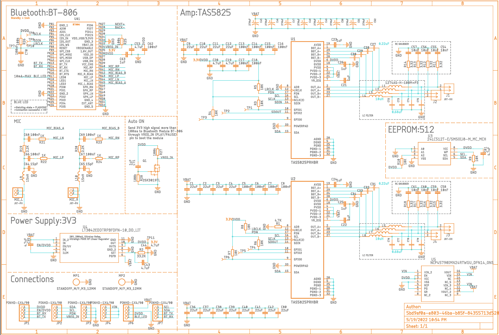
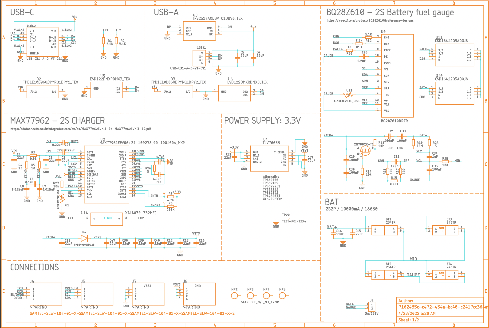
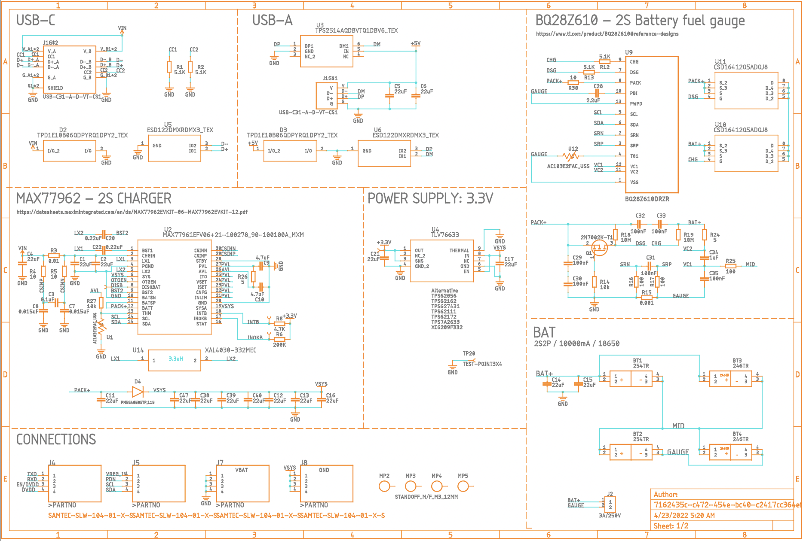

## The Main PCB
It contain the Amplifier - 2x Texas Instruments® TAS5825M and The FSC-BT806 Feasycom.

## The USB-C PCB
It contain the MAX77961 - 3S charging IC, the MAX17320 Fuel Gauge IC and the ATmega328.

